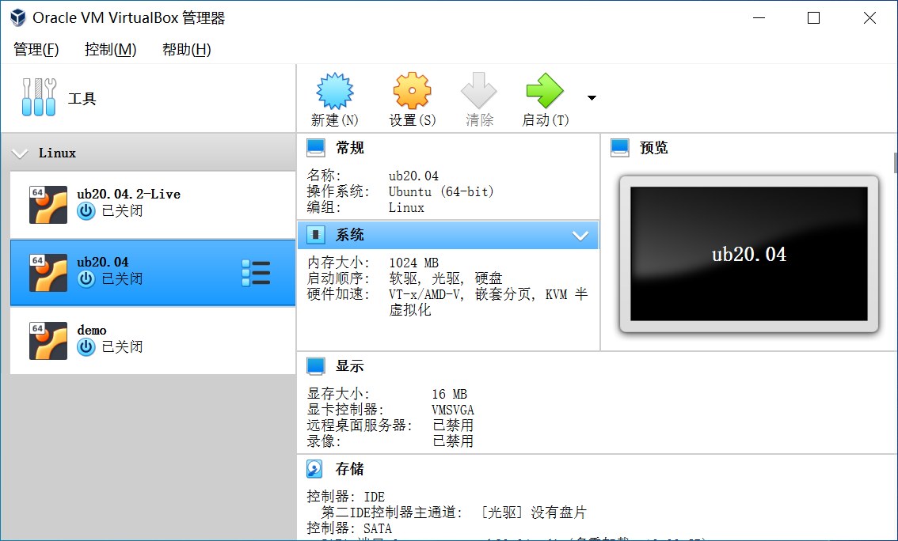
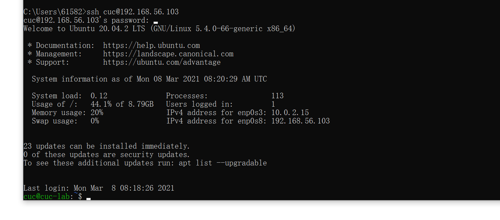
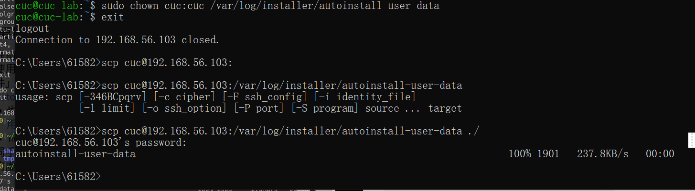
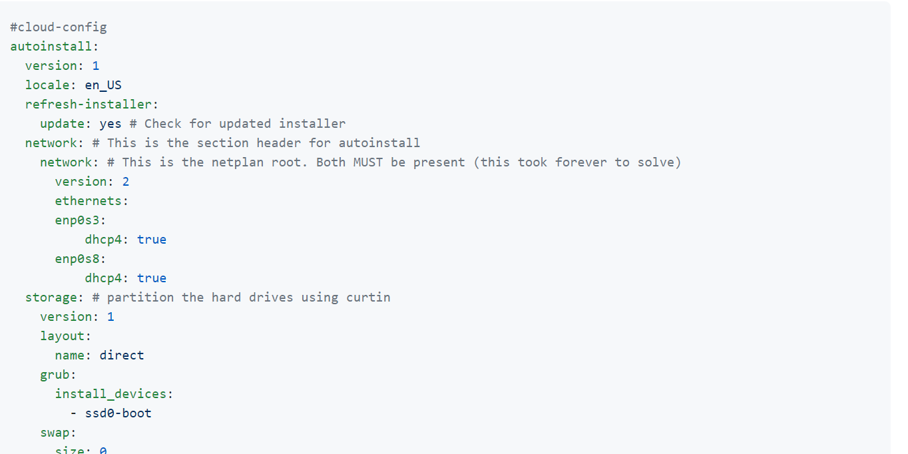
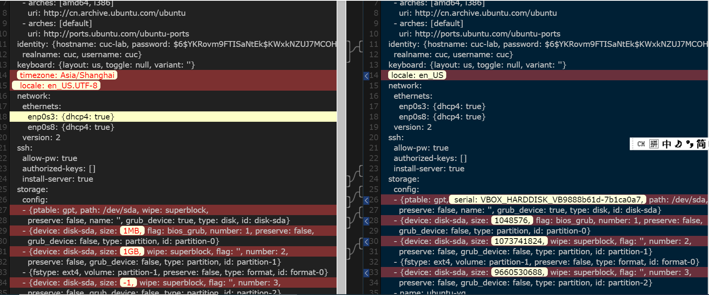
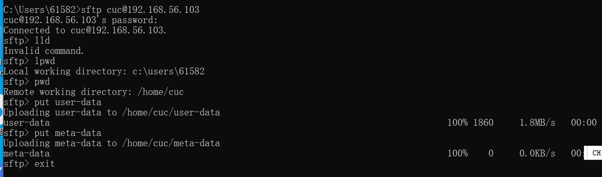
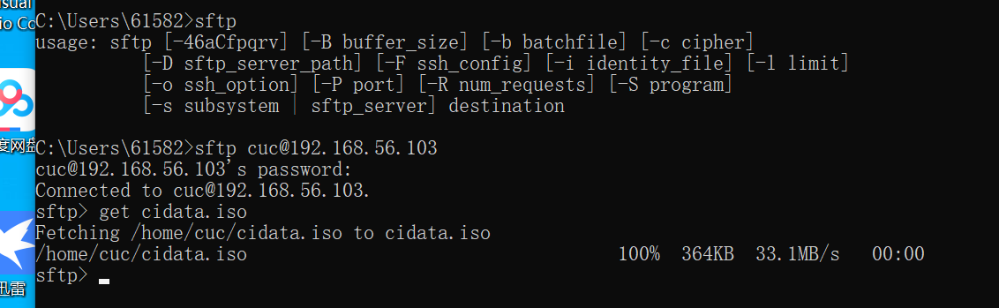
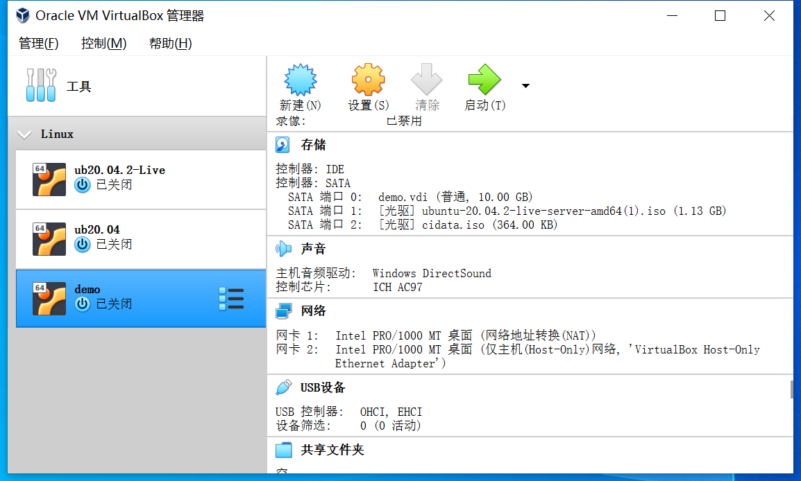
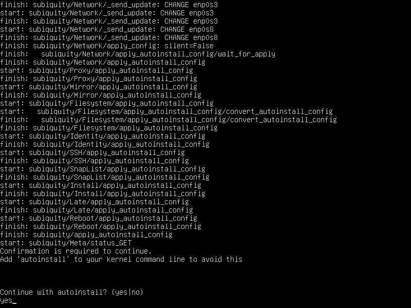
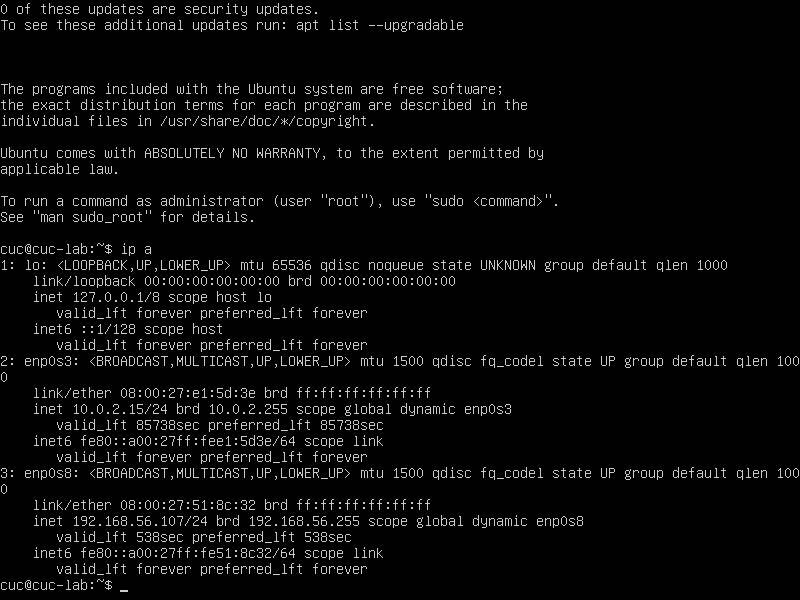

# 基于Ubuntu20.04的无人值守安装

## 实验目的
* 运用所学知识安装ubuntu系统
* 使用远程连接的方式在宿主机和虚拟机交换文件
* 在linux环境下使用genisoimage创建光盘

## 实验环境
* vbox虚拟机最新版本
* ubuntu20.04的镜像

## 实验过程
1. 准备好一个提前安装好的ubuntu20.04, 
2. ssh远程连接这个已装好的虚拟机, ,然后通过chown来给cuc这个用户获取权限，
   ,接着在scp来获得autoinstall-user-data文件，即user-data.

```
   sudo chown cuc:cuc /var/log/installer/autoinstall-user-data

   scp cuc@......(省略):/var/log/installer/autoinstall-user-data
```
3. 获取了这个文件以后，就按要求与示例文件,和老师给的user-data进行比对,把该修改的修改一下，得到自己的user-data文件
4. 按照提示，我需要把这个user-data和一个空的meta-data文件，传输到ubuntu中，使用这个语句创建iso文件，
```
genisoimage -output cidata.iso -volid cidata -joliet -rock user-data meta-data
```
[这是链接](https://cvw.cac.cornell.edu/jetstreampub/imageconfig)
5. 第四步有一个坑，就是不能自己在windows环境下用第三方软件做iso文件，那个iso文件不能完成无人值守的操作，只能在linux环境下使用genisoimage语句
6. ,再把这个iso文件传出来，然后按要求配置好无人值守的环境，
   ，
   启动，终于看到这个问句基本上成功了,不一会儿就装好了

## 实验碰到的问题
* 远程连接交换文件，总是被拒绝 解决：chown语句赋予权限
* win10环境下第三方软件iso文件无效 解决：在Linux环境下使用genisoimage语句来做
   
