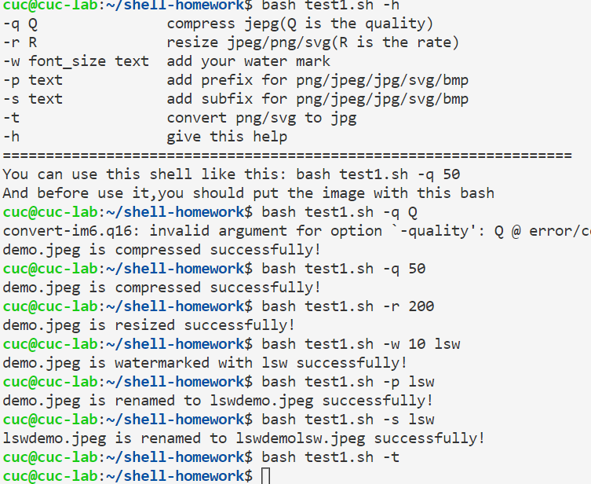
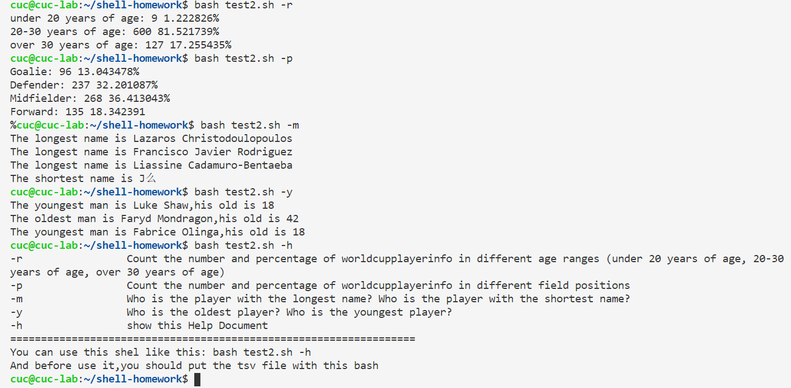
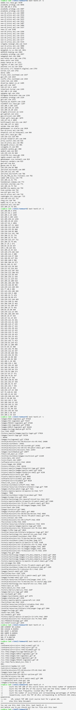

# shell脚本编程
[TOC]
## 实验环境
* Ubuntu 20.04
* 最新版本的vbox 
* 提前配置好ubuntu上的git

## 作业完成情况
### 任务一：
* [x] 支持命令行参数方式使用不同功能
* [x] 支持对指定目录下所有支持格式的图片文件进行批处理指定目录进行批处理
* [x] 支持以下常见图片批处理功能的单独使用或组合使用
* [x] 支持对jpeg格式图片进行图片质量压缩
* [x] 支持对jpeg/png/svg格式图片在保持原始宽高比的前提下压缩分辨率
* [x] 支持对图片批量添加自定义文本水印
* [x] 支持批量重命名（统一添加文件名前缀或后缀，不影响原始文件扩展名）
* [x] 支持将png/svg图片统一转换为jpg格式

### 任务二：

* [x] 统计不同年龄区间范围（20岁以下、[20-30]、30岁以上）的球员数量、百分比
* [x] 统计不同场上位置的球员数量、百分比
* [x] 名字最长的球员是谁？名字最短的球员是谁？
* [x] 年龄最大的球员是谁？年龄最小的球员是谁？

### 任务三：

* [x] 统计访问来源主机TOP 100和分别对应出现的总次数
* [x] 统计访问来源主机TOP 100 IP和分别对应出现的总次数
* [x] 统计最频繁被访问的URL TOP 100
* [x] 统计不同响应状态码的出现次数和对应百分比
* [x] 分别统计不同4XX状态码对应的TOP 10 URL和对应出现的总次数
* [x] 给定URL输出TOP 100访问来源主机

## 实验过程

### 1. 用VScode远程连接虚拟机
### 2. 下载imagemagick，```sudo apt-get update && sudo apt-get install imagemagick```
### 3. 然后进行一系列的操作
### 4. 这是任务一的结果与操作：

### 5. 这是任务二的结果与操作：
  
### 6. 这是任务三的结果与操作（略显冗余）：

   

## 过程中遇到的问题
* 在任务一中，需要提前把文件放到代码平行的文件夹下
* 任务二和任务三中，我们需要避免计算第一行，以免计算出错
* 在awk语句中，似乎使用```if(...==...)```和正则表达式来匹配一直出错，使用match语句后解决

## Travis和个人仓库
* Travis链接：
  [我的Travis](https://travis-ci.com/github/lsw666-gif/linux-2021-lsw666-gif/jobs/499242419)
* 我的个人仓库：
  [个人仓库](https://github.com/lsw666-gif/linux-2021-lsw666-gif)

## 参考资料
* 某位前辈的实验报告：
    [https://github.com/CUCCS/linux-2020-LyuLumos/tree/ch0x04/ch0x04](https://github.com/CUCCS/linux-2020-LyuLumos/tree/ch0x04/ch0x04)
* 循环操作：
    [https://zhuanlan.zhihu.com/p/127382141](https://zhuanlan.zhihu.com/p/127382141)
* awk 的BEGIN...END操作：
    [https://blog.csdn.net/panpan639944806/article/details/19932543](https://blog.csdn.net/panpan639944806/article/details/19932543)
* awk正则表达式：
     [https://www.cnblogs.com/DengGao/p/5935719.html](https://www.cnblogs.com/DengGao/p/5935719.html)   
      
