# shell脚本编程进阶
[TOC]
## 实验环境
* Ubuntu 20.04
* 最新版本的vbox 
* 提前配置好ubuntu上的git

## 作业完成情况
### vsftp：
* [x] 配置一个提供匿名访问的FTP服务器，匿名访问者可以访问1个目录且仅拥有该目录及其所有子目录的只读访问权限；
* [x] 支持对指定目录下所有支持格式的图片文件进行批处理指定目录进行批处理
* [x] 配置一个支持用户名和密码方式访问的账号，该账号继承匿名访问者所有权限
* [x] 且拥有对另1个独立目录及其子目录完整读写（包括创建目录、修改文件、删除文件等）权限；
* [x] 该账号仅可用于FTP服务访问，不能用于系统shell登录；
* [x] FTP用户不能越权访问指定目录之外的任意其他目录和文件
* [x] 匿名访问权限仅限白名单IP来源用户访问，禁止白名单IP以外的访问  

#### 选材理由
1. 功能特性:它可以做基于多个IP的虚拟FTP主机服务器,匿名服务设置十分方便,能够完成实验需求
2. 安全性：支持虚拟用户，并且每个虚拟用户可以具有独立的属性配置，不执行任何外部程序，从而减少了安全隐患
3. 由于实验没要求可扩展性和数据库支持等方面，不用选择pure-ftpd等等其他的ftp

#### 实验过程
1. 配置一个提供匿名访问的FTP服务器，匿名访问者可以访问1个目录且仅拥有该目录及其所有子目录的只读访问权限；
   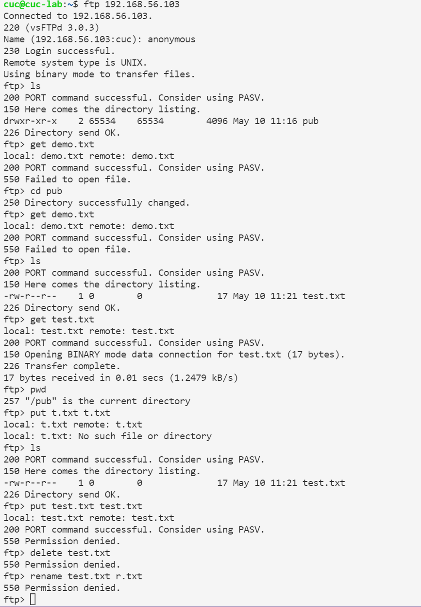

2. 配置一个支持用户名和密码方式访问的账号，该账号继承匿名访问者所有权限，且拥有对另1个独立目录及其子目录完整读写 （包括创建目录、修改文件、删除文件等）权限；该账号仅可用于FTP服务访问，不能用于系统shell登录；
   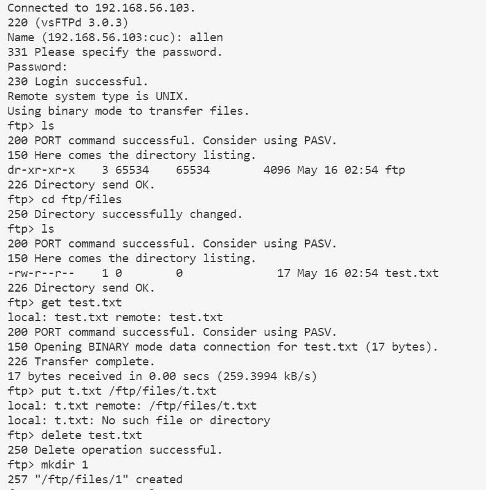

3. 匿名访问权限仅限白名单IP来源用户访问，禁止白名单IP以外的访问
    ```grep -q "vsftpd:192.168.56.101" /etc/hosts.allow || echo "192.168.56.101" >> /etc/hosts.allow```

4. FTP用户不能越权访问指定目录之外的任意其他目录和文件
   ``` # 限制用户使用权限只限于用户目录sed -i -e "/chroot_local_user=/s/^[#]//g;/chroot_local_user=/s/NO/YES/g" "$conf"```


### nfs：

* [x] 在1台Linux上配置NFS服务，另1台电脑上配置NFS客户端挂载2个权限不同的共享目录，分别对应只读访问和读写访问权限
  
#### 验证过程
* 在1台Linux上配置NFS服务，另1台电脑上配置NFS客户端挂载2个权限不同的共享目录，分别对应只读访问和读写访问权限;
  创建的两个目录分别为:只读文件： ```/nfs/gen_r``` 和读写文件： ```/nfs/gen_rw```
    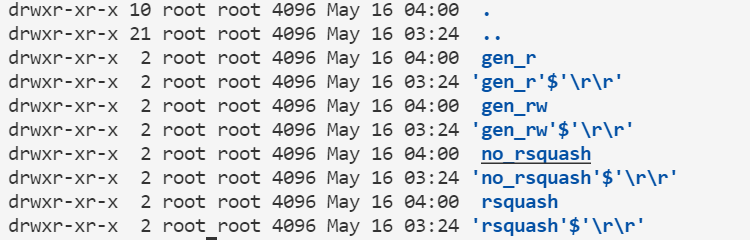

* 两个共享文件目录对应只读和读写访问权限
    
    

* 共享目录中文件、子目录的属主、权限信息
    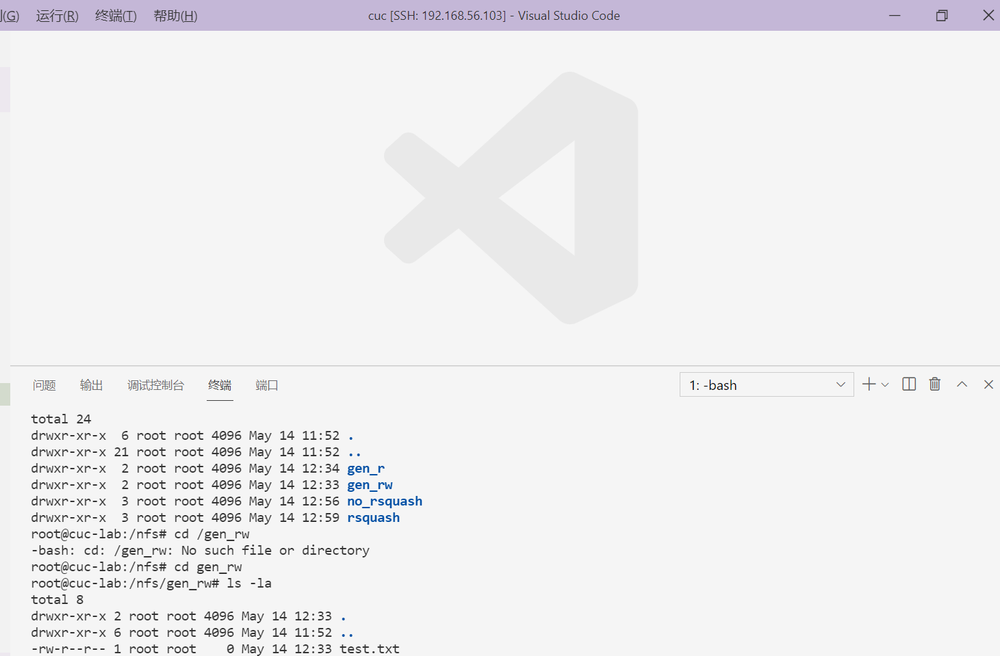
    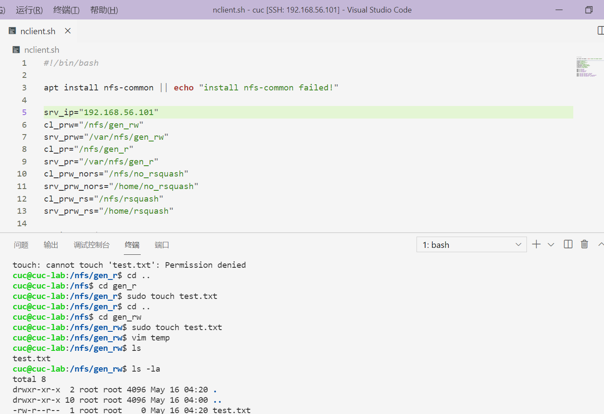

* 通过NFS客户端在NFS共享目录中新建的目录、创建的文件的属主、权限信息
    1. 结果发现，在客户端创建的文件权限为root，在服务端却变成了NFS的匿名用户（nfsnobody）
    2. 查询资料得知： root_squash：将客户端使用的是root用户时，则映射到NFS服务器的用户为NFS的匿名用户   （nfsnobody）no_root_squash：将客户端使用的是root用户时，则映射到FNS服务器的用户依然为root用户。

* 实验问题：后续想进行设置no_root_squash的实验，但是因为开始的nfs服务端，客户端方向弄错了，造成了错误无法进行

### Samba(由于涉及到大量在windows上的操作，所以手动配置)：

* [x] 分别查看基于 Windows 和 Linux 搭建 SMB 共享服务包含的共享目录清单
* [x] 向远程共享目录上传文件和目录
* [x] 从远程共享目录中下载文件和目录

#### 实验过程

* 在虚拟机上操作

```sudo apt-get install samba ```
``` sudo useradd -M -s /sbin/nologin demoUser```
```sudo groupadd demoGroup```
```sudo usermod -a -G demoGroup demoUser```
```sudo passwd demoUser```
```sudo smbpasswd -a cuc```

* 在/etc/samba/smb.conf 文件尾部追加以下“共享目录”配置
```
[demo]
        path = /srv/samba/demo/
        read only = no
        guest ok = no
        force create mode = 0660
        force directory mode = 2770
        force user = demoUser
        force group = demoGroup
```
* 在Windows上手动配置文件用户添加和权限
  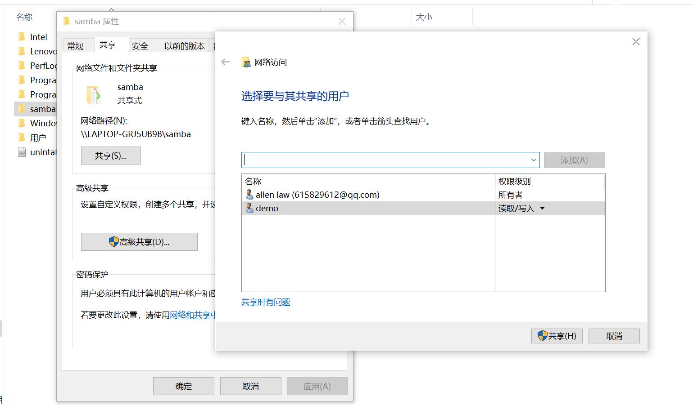


#### 验证过程

* 分别查看基于 Windows 和 Linux 搭建 SMB 共享服务包含的共享目录清单
  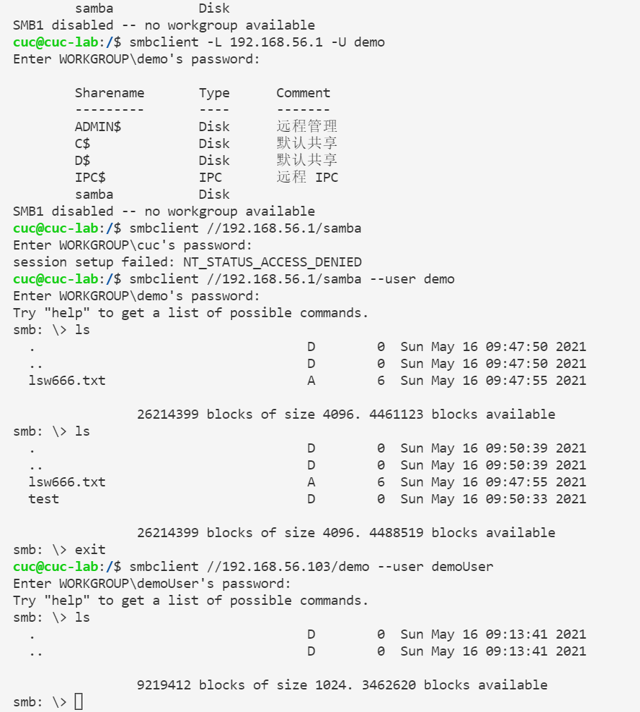

* 从远程共享目录下载文件
  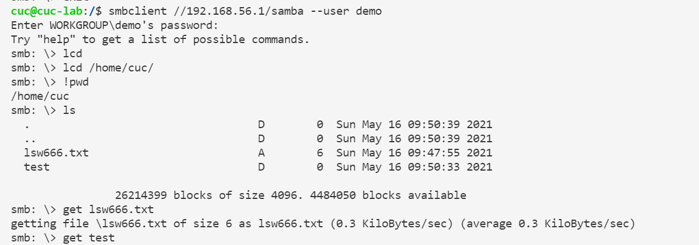

* 向远程共享目录上传文件和目录文件
  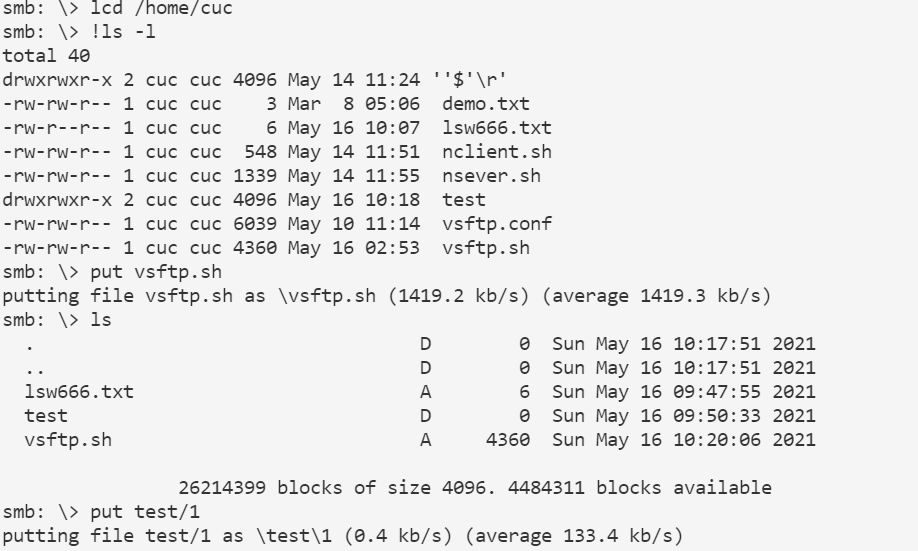
  

### DHCP
* [x] 2台虚拟机使用Internal网络模式连接，其中一台虚拟机上配置DHCP服务，另一台服务器作为DHCP客户端，从该DHCP服务器获取网络地址配置

#### 实验过程
1. 在服务端运行 ```dhcp.sh```文件
2. ```netplan apply``` 应用一下enp0s9的配置
3. 再```sudo systemctl restart isc-dhcp-server```
4. ```ip a```查看enp0s9静态地址配置情况(192.168.57.1/24)
   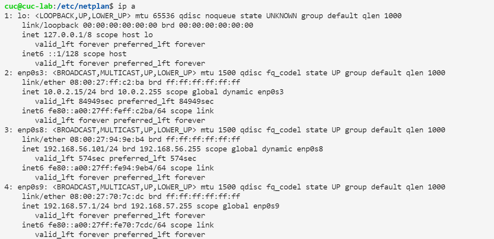
5. ```sudo systemctl status isc-dhcp-server```查看DHCP服务器状态
   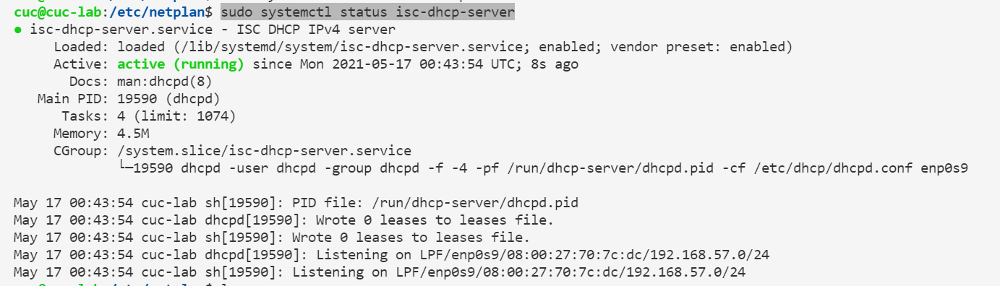
6. 手动在客户端配置,在网络配置文件中添加设置
  ```
  enp0s9: 
      dhcp4: ture
  ```
#### 验证过程
1. 先查看系统日志
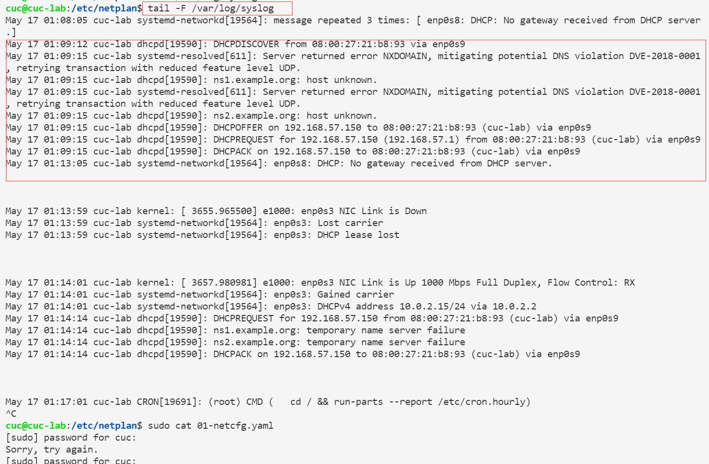

2. 再在客户端ping一下服务端，发现可以ping到
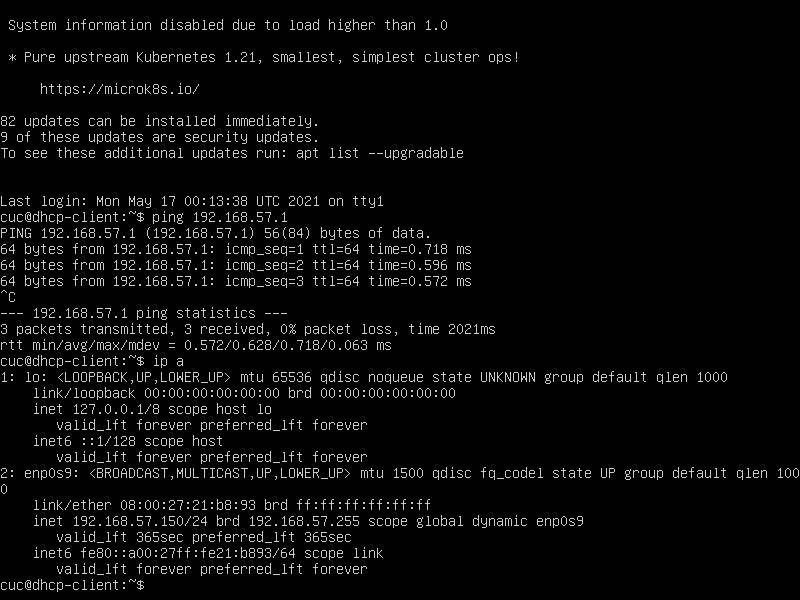

3. 再在服务端ping一下为客户端分配的地址
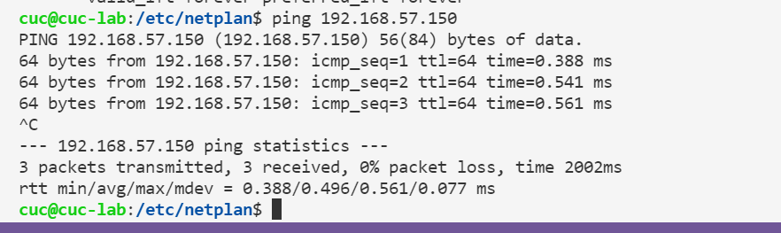  

### DNS
* 基于上述Internal网络模式连接的虚拟机实验环境，在DHCP服务器上配置DNS服务，使得另一台作为DNS客户端的主机可以通过该DNS服务器进行DNS查询;在DNS服务器上添加 zone "cuc.edu.cn" 的以下解析记录

#### 实验过程
1. 在服务端运行```dns.sh```
   
2. 在客户端运行```clientdns.sh```

#### 验证过程
* 服务端
1. 查看```sudo vi /etc/bind/named.conf.options```
   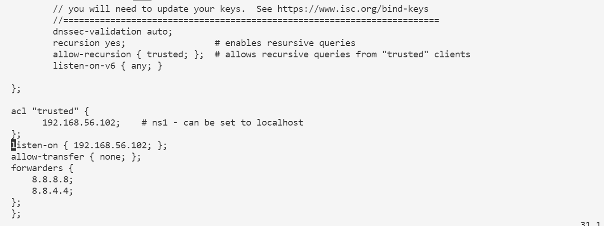
   (有一个```};```我不知道为什么``` tail -n 1 "$options"```没删掉，我手动删掉了)
2. 查看```sudo vi /etc/bind/named.conf.local```
   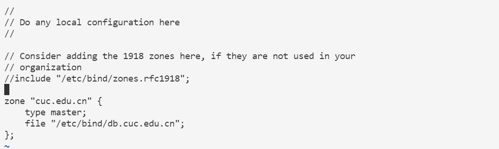
3. 查看```sudo vi /etc/bind/db.cuc.edu.cn```
   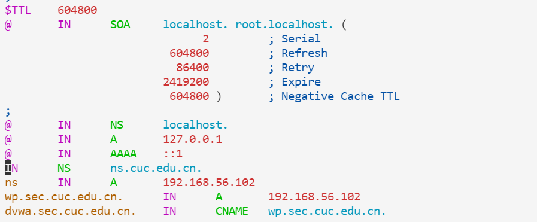
* 客户端
1. 查看```sudo vi /etc/resolvconf/resolv.conf.d/head```
   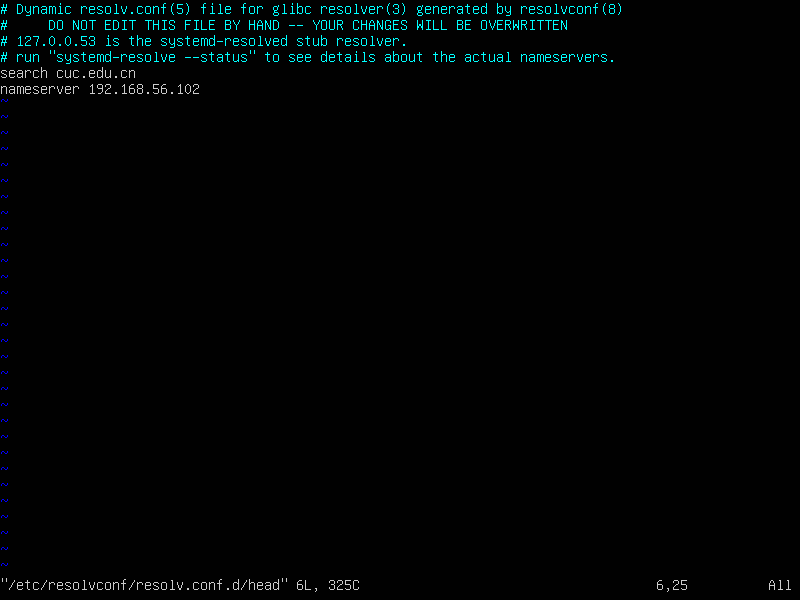


## 过程中遇到的问题
* NFS中在客户端创建的文件权限为root，在服务端却变成了NFS的匿名用户（nfsnobody）查询资料得知：oot_squash：将客户 端使用的是root用户时，则映射到NFS服务器的用户为NFS的匿名用户   （nfsnobody）no_root_squash：将客户端使用的是root用户时，则映射到FNS服务器的用户依然为root用户
* NFS中后续想进行设置no_root_squash的实验，但是因为开始的nfs服务端，客户端方向弄错了，造成了错误无法进行
* Samba中有大量需要windows图像化界面操作，所以我手动配置了
* DHCP中```sudo systemctl restart isc-dhcp-server```一开始老是status告诉我failed，后来发现是没查虚拟机内网的网线，就尬住了
* DHCP中在服务端千万不要在网络配置中画蛇添足提前把内网enp0s9的dhcp设置成true,这样的表示会和原来的静态地址冲突
* DNS中(有一个```};```我不知道为什么``` tail -n 1 "$options"```没删掉，我手动删掉了)


## 参考资料
* 某位前辈的实验报告：
   [他的报告](https://github.com/CUCCS/linux-2020-LyuLumos/blob/ch0x06/ch0x06/%E7%AC%AC%E5%85%AD%E6%AC%A1%E5%AE%9E%E9%AA%8C%E6%8A%A5%E5%91%8A.md)

* NFS(参考18.04)：
   [How To Set Up an NFS Mount on Ubuntu 18.04](https://www.digitalocean.com/community/tutorials/how-to-set-up-an-nfs-mount-on-ubuntu-18-04)

* DNS:
   [Setup Bind9 on Ubuntu 20.04](https://bist.be/2020/04/27/setup-bind9-on-ubuntu-20-04/)

* Vsftp:
   [How to setup FTP server on Ubuntu 20.04 Focal Fossa Linux](https://linuxconfig.org/how-to-setup-ftp-server-on-ubuntu-20-04-focal-fossa-linux)

* Samba:主要是看老师的B站

* DHCP:
   [Ubuntu20.04配置配置DHCP服务及两台电脑ping包实验](https://blog.csdn.net/Nice_1997/article/details/115130571)
  
   


